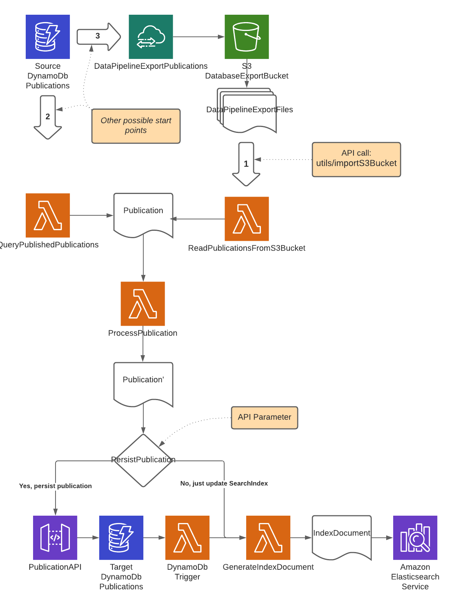

# nva-search-api
A common search API for NVA across resources

### GET /search/resources? [resource parameters](search-commons/src/main/java/no/unit/nva/search2/resource.md)

### GET /search/customer/resources? [resource parameters](search-commons/src/main/java/no/unit/nva/search2/resource.md)

#### Structure in response from Response endpoints

```JSON
{
  "id": "https://api.dev.nva.aws.unit.no/search/resources",
  "totalHits": 120387,
  "hits": [],
  "nextResults": "https://api.dev.nva.aws.unit.no/search/resources?aggregation=all&size=10&from=20",
  "previousResults": "https://api.dev.nva.aws.unit.no/search/resources?aggregation=all&size=10&from=0",
  "aggregations": {
    "type": [],
    "license": [],
    "contributor": [],
    "journal": [],
    "series": [],
    "contextType": [],
    "course": [],
    "publisher": [],
    "files": [],
    "fundingSource": [],
    "scientificIndex": [],
    "status": [],
    "topLevelOrganization": []
  },
  "@context": "https://bibsysdev.github.io/src/search/paginated-search-result.json"
}
```

### GET /search/customer/tickets? [ticket parameters](search-commons/src/main/java/no/unit/nva/search2/ticket.md)

**Structure in response from ticket endpoint**

```JSON
{
  "id": "https://api.dev.nva.aws.unit.no/search/customer/tickets",
  "totalHits": 120387,
  "hits": [],
  "nextResults": "https://api.dev.nva.aws.unit.no/search/customer/tickets?aggregation=all&size=10&from=20",
  "previousResults": "https://api.dev.nva.aws.unit.no/search/customer/tickets?aggregation=all&size=10&from=0",
  "aggregations": {
    "type": [],
    "notifications": [],
    "status": [],
    "byUserPending": []
  },
  "@context": "https://bibsysdev.github.io/src/search/paginated-search-result.json"
}
```

### GET /search/importcandidates? [import-candidate parameters](search-commons/src/main/java/no/unit/nva/search2/importCandidate.md)

**Structure in response from import-candidate endpoint**

```JSON
{
  "id": "https://api.dev.nva.aws.unit.no/search/importcandidates",
  "totalHits": 120387,
  "hits": [],
  "nextResults": "https://api.dev.nva.aws.unit.no/search/importcandidates?aggregation=all&size=10&from=20",
  "previousResults": "https://api.dev.nva.aws.unit.no/search/importcandidates?aggregation=all&size=10&from=0",
  "aggregations": {},
  "@context": "https://bibsysdev.github.io/src/search/paginated-search-result.json"
}
```

**All aggregations have the following format**

```JSON
{
  "type": {
    "id": "https://unset/resource/search?type=RequestType",
    "key": "RequestType",
    "count": 1,
    "labels": {
      "nb": "Første type",
      "en": "First kind"
    }
  }
}
```

  
---
### Utility startpoints and flows ###

