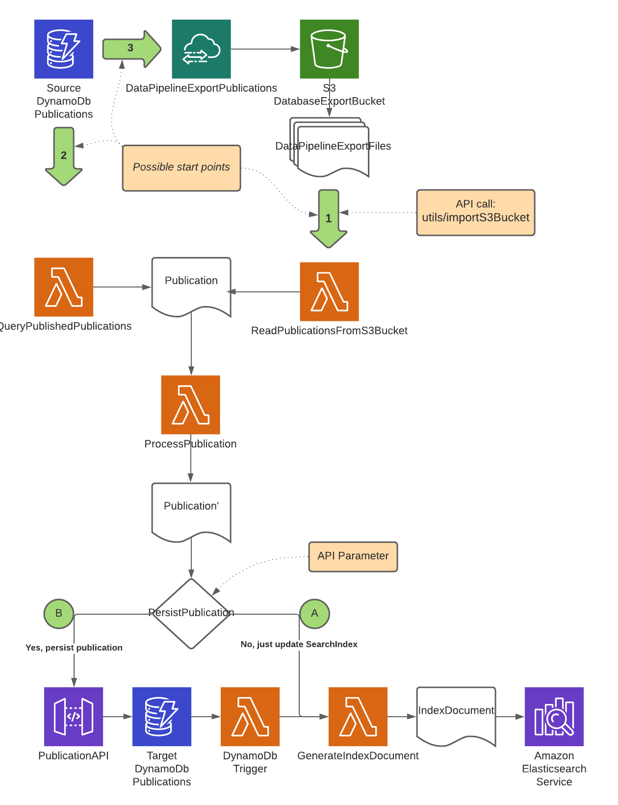

# NVA search api

README for the search api in NVA. The API was created to allow third parties to make queries to our search engine backed
by Amazon OpenSearch.

Every endpoint documented here is implemented with the same philosophy and technology. We exposes part of the indexed
documents as search keys.

## Search Keys

Key names are case-insensitive and can be in <code>camelCase</code> or <code>SNAKE_CASE</code>. Each search key allow
searching a field or sometimes fields for content, and most keys comes
in three variants.
Every search key applied are joined with <code>AND</code> between them, making the query more restricted for each key
added to the search.

- **keyName**
    - Usually a [keyword search](https://opensearch.org/docs/2.13/field-types/supported-field-types/keyword/), see
      Parameter README for details.
    - Supports search for several keywords, separated by comma.
        - Depending on underlying structure require, either ALL or ONE OR MORE to hit, see Parameter README for details.
- **keyName + not**
    - Should always return the inverse selection of just KeyName
- **keyName + should**
    - Usually a [text search](https://opensearch.org/docs/2.13/field-types/supported-field-types/text/), see Parameter
      README for details.
    - Supports search for several text phrases, separated by comma.
        - Usually ONE OR MORE to hit, see Parameter README for details.

### QueryKind

* number
    * Integer
* date
    * DateTimeFormat -> <code> yyyy | yyyy-MM-dd | yyyy-MM-ddTHH:mm:ssZ | yyyy-MM-ddTHH:mm:ss.SSSZ</code>
* keyword
    * Only hit on complete field
* fuzzy_keyword
    * will hit on partial field, boost hits on complete field
* text
    * hits on any partial match in field(s), boosts on exact match and phrases
* free_text
    * Search through whole document
* custom
    * some keys have more complex search algorithms

### Free text search

We support free text search through all parts of our indexed documents. As with all other search keys, we support
searching for several phrases, comma separated. All phrases have to match.
It is possible to specify which fields to search through, but its use is limited and not recommended to use.

| key_name   | keyName   | queryKind         | scope                     |
|------------|-----------|-------------------|---------------------------|
| search_all | searchAll | text with ranking | all_items across document |
| query      | query     | text with ranking | all_items across document |
| fields     | fields    | list of keys      | user, tags, title         |

### Pagination, aggregation & sorting

Every endpoint have the same syntax and functionality in regard to sorting, paging & aggregation.
Each endpoint have their own list of valid sortKeys, see README for each endpoint for details.

| key_name     | keyName     | queryKind    | example                                       |
|--------------|-------------|--------------|-----------------------------------------------|
| aggregation  | aggregation | Enum         | all, none                                     |
| page         | page        | number       | 0 to 10000/size                               |
| from         | from        | number       | 0 to 10000-size                               |
| size         | size        | number       | 0 to 1000                                     |
| sort         | sort        | Enum(:order) | key1, key1:asc, key1:desc, key1:asc,key2:desc |
| sort_order   | sortOrder   | Enum         | asc, desc                                     |
| search_after | searchAfter | sortindex    | supplied by api                               |

<details>
<summary>Aggregations have the following JSON format</summary>

**"id"** is the current query with the selected aggregation/filter added to it, useful for drill-downs into
sub-selections of the resource.

If you want to filter on an aggregation without the current filter included, you can construct a search key by using the
aggregation name + key value .
(i.e. type=RequestType)

```JSON
{
  "type": {
    "id": "https://unset/resource/search?type=RequestType&aggregation=all&size=10&from=0",
    "key": "RequestType",
    "count": 1,
    "labels": {
      "nb": "Første type",
      "en": "First kind"
    }
  }
}
```

</details>

## Useful links

- API documentation
    - [NVA git README](https://github.com/BIBSYSDEV/nva-api-documentation/blob/main/README.md)
    - [NVA swagger (test)](https://swagger-ui.test.nva.aws.unit.no/#/NVA+Public+Search+API)
    - [NVA swagger (production)](https://swagger-ui.nva.unit.no/#/NVA+Public+Search+API)
    - READMES (Endpoint parameter documentation)
        - [Resources](search-commons/src/main/java/no/unit/nva/search2/resource.md)
        - [Tickets](search-commons/src/main/java/no/unit/nva/search2/ticket.md)
        - [Import-candidates](search-commons/src/main/java/no/unit/nva/search2/importCandidate.md)
- API Endpoints
    - Test
        - https://api.test.nva.aws.unit.no/search/resources
        - https://api.test.nva.aws.unit.no/search/customer/resources
        - https://api.test.nva.aws.unit.no/search/customer/tickets
        - https://api.test.nva.aws.unit.no/search/import-candidates2
    - Production
        - https://api.nva.unit.no/search/resources
        - https://api.nva.unit.no/search/customer/resources
        - https://api.nva.unit.no/search/customer/tickets

## Resource

Valid search parameters [/search/resources?parameters=...](search-commons/src/main/java/no/unit/nva/search2/resource.md)

```http request
GET /search/resources HTTP/1.1
Host: api.test.nva.aws.unit.no
Accept: application/json
```

```http request
GET /search/resources HTTP/1.1
Host: api.test.nva.aws.unit.no
Accept: application/csv
```

## Resource (logged in user)

Valid search
parameters [/search/customer/resources?parameters=...](search-commons/src/main/java/no/unit/nva/search2/resource.md)

```http request
GET /search/customer/resources HTTP/1.1
Host: api.test.nva.aws.unit.no
Accept: application/json
```

<details>
<summary>JSON from Response endpoints</summary>

```JSON
{
  "id": "https://api.dev.nva.aws.unit.no/search/resources",
  "totalHits": 120387,
  "hits": [],
  "nextResults": "https://api.dev.nva.aws.unit.no/search/resources?aggregation=all&size=10&from=20",
  "previousResults": "https://api.dev.nva.aws.unit.no/search/resources?aggregation=all&size=10&from=0",
  "aggregations": {
    "type": [],
    "license": [],
    "contributor": [],
    "journal": [],
    "series": [],
    "contextType": [],
    "course": [],
    "publisher": [],
    "files": [],
    "fundingSource": [],
    "scientificIndex": [],
    "status": [],
    "topLevelOrganization": []
  },
  "@context": "https://bibsysdev.github.io/src/search/paginated-search-result.json"
}
```

</details>

## Ticket

Valid search parameters
[/search/customer/tickets?parameters=...](search-commons/src/main/java/no/unit/nva/search2/ticket.md)

```http request
GET /search/customer/tickets HTTP/1.1
Host: api.test.nva.aws.unit.no
Accept: application/json
```

<details>
<summary>JSON from ticket endpoint</summary>

```JSON
{
  "id": "https://api.dev.nva.aws.unit.no/search/customer/tickets",
  "totalHits": 120387,
  "hits": [],
  "nextResults": "https://api.dev.nva.aws.unit.no/search/customer/tickets?aggregation=all&size=10&from=20",
  "previousResults": "https://api.dev.nva.aws.unit.no/search/customer/tickets?aggregation=all&size=10&from=0",
  "aggregations": {
    "type": [],
    "notifications": [],
    "status": [],
    "byUserPending": []
  },
  "@context": "https://bibsysdev.github.io/src/search/paginated-search-result.json"
}
```

</details>

## Import-candidate

Valid search parameters
[/search/import-candidates2?parameters=...](search-commons/src/main/java/no/unit/nva/search2/importCandidate.md)

```http request
GET /search/import-candidates2 HTTP/1.1
Host: api.test.nva.aws.unit.no
Accept: application/json
```

<details>
<summary>JSON from import-candidate endpoint</summary>

```JSON
{
  "id": "https://api.dev.nva.aws.unit.no/search/importcandidates2",
  "totalHits": 120387,
  "hits": [],
  "nextResults": "https://api.dev.nva.aws.unit.no/search/importcandidates2?aggregation=all&size=10&from=20",
  "previousResults": "https://api.dev.nva.aws.unit.no/search/importcandidates2?aggregation=all&size=10&from=0",
  "aggregations": {},
  "@context": "https://bibsysdev.github.io/src/search/paginated-search-result.json"
}
```
</details>

  
---

## Utility startpoints and flows ###

